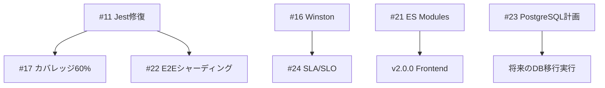

# 🗺️ ITSM System Development Roadmap

> **最終更新**: 2026-01-11
> **現在のバージョン**: v2.1.0 ✅
> **目標**: Enterprise Grade ITSM Platform (v3.0.0)

---

## 📊 Executive Summary

本ロードマップは、v2.1.0から次のマイルストーンを経てv3.0.0（エンタープライズグレード完成版）に到達するための詳細計画です。

### ✅ 達成済みマイルストーン

| マイルストーン | 完了日 | 主要成果 |
|:---|:---:|:---|
| **v1.0.0 - Foundation** | 2025-12-28 | 基本ITSM機能、JWT認証、RBAC |
| **v1.5.0 - SLA Enhancement** | 2026-01-03 | SLA管理強化、監査ダッシュボード |
| **v2.0.0 - Dashboard & Integration** | 2026-01-07 | 統合ダッシュボード、M365/ServiceNow統合 |
| **v2.1.0 - Security & Performance** | 2026-01-11 | HTTPS/TLS、脅威検知、ESLint修正完了 |

### 📋 今後のマイルストーン

| マイルストーン | 期間 | 主要目標 | Issue数 |
|:---|:---:|:---|:---:|
| **v2.2.0 - Security Hardening** | 4週間 | JWT Cookie移行、タイミング攻撃対策 | 4件 (P0×2, P1×2) |
| **v2.5.0 - Quality & Scale** | 6週間 | PostgreSQL移行、構造化ロギング | 4件 (P1×2, P2×2) |
| **v3.0.0 - Enterprise Grade** | 8週間 | マルチテナント本番化、高可用性 | 3件 (P2×3) |

---

## 🎯 Version Milestones

### v1.1.0: Security First 🛡️
**期間**: Week 1-4 (2026-01-13 ~ 2026-02-09)
**テーマ**: セキュリティファースト - 本番運用のための必須対策完了

#### 📋 含まれるIssues

**P0 (Critical) - 4件** - 最優先で完了すべき重大脆弱性:
- [#9](https://github.com/owner/repo/issues/9) 🔴 APIキーのローテーションとGit履歴からの完全削除
- [#10](https://github.com/owner/repo/issues/10) 🔴 JWT認証をLocalStorageからHttpOnly Cookieへ移行
- [#11](https://github.com/owner/repo/issues/11) 🔴 Jest globalSetup.js欠損によるテストカバレッジ測定不可を修復
- [#12](https://github.com/owner/repo/issues/12) 🔴 auto-repair.ymlのmain直接プッシュをPRベースに変更

**P1 (High) - 5件** - 品質と運用性に関わる重要課題:
- [#14](https://github.com/owner/repo/issues/14) 🟠 デフォルトパスワードのハードコードを修正
- [#15](https://github.com/owner/repo/issues/15) 🟠 開発ログからのシークレット除去
- [#16](https://github.com/owner/repo/issues/16) 🟠 構造化ロギング導入（Winston）
- [#18](https://github.com/owner/repo/issues/18) 🟠 CI/CDロールバック手順作成
- [#19](https://github.com/owner/repo/issues/19) 🟠 緊急時対応Runbook 5件作成

#### 🗓️ 週次スプリント計画

**Week 1 (Jan 13-19): Critical Security Fixes**
```
Mon-Tue: #9  APIキー完全削除（Git履歴含む）
Wed-Thu: #10 JWT Cookie移行（フロントエンド+バックエンド）
Fri:     #14 デフォルトパスワード修正
```
- 🎯 ゴール: P0セキュリティ脆弱性の50%解決
- 📊 工数: 40時間（フルタイム2名）
- ⚠️ リスク: Git履歴削除時のブランチ同期問題

**Week 2 (Jan 20-26): CI/CD & Test Infrastructure**
```
Mon-Tue: #11 Jest globalSetup修復 + カバレッジ測定
Wed-Thu: #12 CI/CDワークフロー安全化
Fri:     #15 開発ログシークレット除去
```
- 🎯 ゴール: P0完全解決 + CI/CD品質ゲート確立
- 📊 工数: 40時間
- ⚠️ リスク: テスト環境セットアップの複雑性

**Week 3 (Jan 27 - Feb 2): Structured Logging & Observability**
```
Mon-Wed: #16 Winston構造化ロギング導入
Thu-Fri: #18 CI/CDロールバック手順作成・テスト
```
- 🎯 ゴール: 本番運用監視基盤の確立
- 📊 工数: 40時間
- ⚠️ リスク: ログフォーマット変更による既存監視ツール影響

**Week 4 (Feb 3-9): Operations Documentation**
```
Mon-Fri: #19 緊急時対応Runbook 5件
         - DB復旧手順
         - サービス停止時対応
         - セキュリティインシデント対応
         - パフォーマンス劣化対応
         - データ損失対応
```
- 🎯 ゴール: 運用チームの24/7対応可能体制構築
- 📊 工数: 40時間
- ⚠️ リスク: 実環境でのRunbook検証不足

#### 🚀 Quick Wins（Week 1内で完了可能）
1. ✅ #14 デフォルトパスワード修正（2時間）
2. ✅ #15 ログファイルからのシークレット削除（4時間）
3. ✅ #20 GitHub Secrets活用開始（3時間）

#### 📈 v1.1.0 リリース判定基準（Definition of Done）

| 基準 | 目標値 | 測定方法 |
|:---|:---:|:---|
| P0 Issue解決率 | 100% | GitHub Issues Status |
| P1 Issue解決率 | 100% | GitHub Issues Status |
| セキュリティスキャン合格 | Critical 0件 | npm audit / Snyk |
| テストカバレッジ | ≥50% | Jest Coverage Report |
| CI/CDパイプライン成功率 | ≥95% | GitHub Actions Analytics |
| ドキュメント完成度 | 5/5 Runbooks | Manual Review |

---

### v1.2.0: Quality Boost 📈
**期間**: Week 5-10 (2026-02-10 ~ 2026-03-23)
**テーマ**: 品質向上 - テストカバレッジ・パフォーマンス・コード品質

#### 📋 含まれるIssues

**P1 (High) - 1件**:
- [#17](https://github.com/owner/repo/issues/17) 🟠 テストカバレッジ60%達成

**P2 (Medium) - 2件**:
- [#20](https://github.com/owner/repo/issues/20) 🟡 GitHub Actions Secrets活用
- [#22](https://github.com/owner/repo/issues/22) 🟡 E2Eテストシャーディング実装

#### 🗓️ 週次スプリント計画

**Week 5-6 (Feb 10-23): Test Coverage Enhancement**
```
Sprint Goal: バックエンドテストカバレッジ 40% → 60%
- Unit Tests: 新規30ファイル作成
  - services層: 10ファイル（microsoftGraphService, multiTenantServiceなど）
  - routes層: 15ファイル（assets, problems, releases, slaなど）
  - middleware層: 5ファイル（errorHandler, rbac, metricsなど）
- Integration Tests: 既存強化（10ファイル）
- Performance Tests: 新規追加（5シナリオ）
```
- 🎯 ゴール: カバレッジ60%達成
- 📊 工数: 80時間（QA 1名 + Dev 1名）
- ⚠️ リスク: レガシーコードのテスタビリティ低さ

**Week 7-8 (Feb 24 - Mar 9): E2E Test Optimization**
```
Sprint Goal: E2Eテスト実行時間 50%短縮
- #22 Playwright Test Sharding導入
  - 並列実行数: 4 workers
  - テストグループ分割: Auth / CRUD / Reports / Integration
- CI/CD最適化
  - キャッシュ戦略改善
  - 条件付きテスト実行
```
- 🎯 ゴール: E2E実行時間 12分 → 6分
- 📊 工数: 64時間
- ⚠️ リスク: 並列実行時のデータ競合

**Week 9-10 (Mar 10-23): Security & Code Quality Refinement**
```
Sprint Goal: セキュリティ・コード品質の継続的改善
- #20 GitHub Actions Secrets完全移行
  - .envファイルからSecrets移行
  - ローカル開発環境の分離
- Code Refactoring
  - ESLint警告ゼロ化
  - Prettier適用率100%
  - 循環的複雑度改善（上位10ファイル）
```
- 🎯 ゴール: 技術的負債30%削減
- 📊 工数: 64時間
- ⚠️ リスク: リファクタリングによる予期せぬバグ混入

#### 📈 v1.2.0 リリース判定基準

| 基準 | 目標値 | 測定方法 |
|:---|:---:|:---|
| テストカバレッジ | ≥60% | Jest Coverage Report |
| E2E実行時間 | ≤6分 | Playwright Test Report |
| CI/CD実行時間 | ≤10分 | GitHub Actions Duration |
| ESLint警告 | 0件 | npm run lint |
| セキュリティスキャン | High以上 0件 | npm audit |

---

### v2.0.0: Enterprise Grade 🏢
**期間**: Week 11-22 (2026-03-24 ~ 2026-06-07)
**テーマ**: エンタープライズ対応 - スケーラビリティ・高可用性・マルチテナント

#### 📋 含まれるIssues

**P2 (Medium) - 3件**:
- [#21](https://github.com/owner/repo/issues/21) 🟡 フロントエンドES Modules化
- [#23](https://github.com/owner/repo/issues/23) 🟡 PostgreSQL移行計画策定
- [#24](https://github.com/owner/repo/issues/24) 🟡 SLA/SLO定義とダッシュボード作成

#### 🗓️ フェーズ計画

**Phase 1: Frontend Modernization (Week 11-14)**
```
Goal: #21 フロントエンドアーキテクチャ刷新
- ES Modules移行
  - app.js → 分割モジュール化（10+ modules）
  - 依存関係整理（Chart.js, i18next, etc.）
  - バンドラー導入検討（Vite / Rollup）
- State Management導入
  - 認証状態管理
  - API通信レイヤー
- Performance Optimization
  - Code Splitting
  - Lazy Loading
  - Tree Shaking
```
- 🎯 ゴール: モダンフロントエンド基盤確立
- 📊 工数: 160時間（Frontend Dev 2名）
- ⚠️ リスク: 既存機能の互換性維持

**Phase 2: Database Migration Planning (Week 15-18)**
```
Goal: #23 PostgreSQL移行のための詳細計画
- 移行戦略策定
  - ゼロダウンタイム移行手法
  - データ整合性検証方法
  - ロールバック計画
- スキーマ設計
  - SQLite → PostgreSQL変換
  - インデックス最適化
  - パーティショニング戦略
- パフォーマンステスト
  - 負荷テストシナリオ作成
  - ベンチマーク実施（SQLite vs PostgreSQL）
- マイグレーションツール開発
  - データ移行スクリプト
  - 整合性チェックツール
```
- 🎯 ゴール: 移行実行可能な詳細計画完成
- 📊 工数: 160時間（DB Expert 1名 + Backend Dev 1名）
- ⚠️ リスク: 大規模データでのパフォーマンス劣化

**Phase 3: SLA/SLO & Monitoring (Week 19-22)**
```
Goal: #24 エンタープライズ品質保証体制
- SLA/SLO定義
  - 可用性: 99.9% (月間ダウンタイム 43分以内)
  - レスポンスタイム: P95 < 500ms
  - エラー率: < 0.1%
  - MTTR: < 15分
- Monitoring Dashboard構築
  - Prometheus + Grafana
  - カスタムメトリクス実装
  - アラート設定（PagerDuty連携）
- Incident Management
  - インシデント対応フロー
  - ポストモーテムプロセス
  - SLAレポート自動生成
```
- 🎯 ゴール: 本番運用品質保証体制確立
- 📊 工数: 160時間（DevOps 1名 + SRE 1名）
- ⚠️ リスク: モニタリングツール導入コスト

#### 🚀 v2.0.0の追加機能（将来拡張）

以下は今回のロードマップには含まれませんが、v2.0.0以降の拡張候補です:

1. **マルチテナント対応**
   - テナント分離アーキテクチャ
   - テナント別データベース
   - テナント別カスタマイズ

2. **高可用性構成**
   - データベースレプリケーション
   - ロードバランシング
   - フェイルオーバー自動化

3. **API Gateway導入**
   - レートリミット強化
   - API バージョニング
   - GraphQL対応

4. **AI/ML統合**
   - インシデント自動分類
   - 異常検知アラート
   - チャットボット対応

#### 📈 v2.0.0 リリース判定基準

| 基準 | 目標値 | 測定方法 |
|:---|:---:|:---|
| フロントエンドビルドサイズ | < 500KB (gzip) | Vite Build Analysis |
| PostgreSQL移行計画完成度 | 100% | Plan Review Checklist |
| SLA達成率 | ≥99.9% | Uptime Monitor |
| API P95レスポンスタイム | < 500ms | Prometheus Metrics |
| テストカバレッジ | ≥70% | Jest Coverage Report |

---

## 📊 リソース配分計画

### チーム構成推奨

| ロール | 人数 | v1.1.0 | v1.2.0 | v2.0.0 |
|:---|:---:|:---:|:---:|:---:|
| **Backend Developer** | 2名 | 60% | 50% | 40% |
| **Frontend Developer** | 1名 | 20% | 20% | 50% |
| **DevOps Engineer** | 1名 | 15% | 20% | 30% |
| **QA Engineer** | 1名 | 5% | 40% | 20% |
| **Database Specialist** | 0.5名 | 0% | 0% | 30% |
| **Security Engineer** | 0.5名 | 30% | 10% | 10% |

### 工数サマリー

| バージョン | 期間 | 総工数 | 週平均 | 備考 |
|:---|:---:|:---:|:---:|:---|
| **v1.1.0** | 4週間 | 160時間 | 40h/週 | フルタイム2名相当 |
| **v1.2.0** | 6週間 | 208時間 | 35h/週 | フルタイム1.75名相当 |
| **v2.0.0** | 12週間 | 480時間 | 40h/週 | フルタイム2名相当 |
| **合計** | 22週間 | 848時間 | 39h/週 | - |

### 並列実行可能タスク

**v1.1.0での並列化**:
```
Track A (Backend):  #9 → #10 → #11 → #16
Track B (Security): #14 → #15 → #18 → #19
Track C (CI/CD):    #12 → (wait #11) → #18
```

**v1.2.0での並列化**:
```
Track A (Backend):  #17 (Unit Tests)
Track B (E2E):      #22 (Sharding)
Track C (DevOps):   #20 (Secrets)
```

**v2.0.0での並列化**:
```
Track A (Frontend): #21 (ES Modules)
Track B (Database): #23 (PostgreSQL Planning)
Track C (SRE):      #24 (SLA/SLO)
```

---

## ⚠️ リスク管理マトリクス

### 技術的リスク

| リスク | 影響度 | 発生確率 | 対策 | 担当 |
|:---|:---:|:---:|:---|:---|
| **Git履歴削除時のリポジトリ破損** | 🔴 High | 🟡 Medium | バックアップ取得、テストリポジトリで事前検証 | DevOps |
| **JWT Cookie移行時の認証エラー** | 🔴 High | 🟡 Medium | 段階的ロールアウト、ロールバック計画 | Backend |
| **PostgreSQL移行時のデータ損失** | 🔴 High | 🟢 Low | フルバックアップ、整合性検証、パイロット実施 | DBA |
| **E2E並列実行時のデータ競合** | 🟡 Medium | 🟡 Medium | テストデータ分離、トランザクション管理 | QA |
| **ES Modules移行時の互換性問題** | 🟡 Medium | 🔴 High | Feature Flag、A/Bテスト、段階的移行 | Frontend |
| **Winston導入時のログ欠損** | 🟢 Low | 🟡 Medium | 既存ロギング並行稼働、段階的切替 | Backend |

### スケジュールリスク

| リスク | 影響 | 対策 |
|:---|:---:|:---|
| **テストカバレッジ60%達成遅延** | +2週間 | Quick Win（既存テスト強化）を優先、新規テストは並列化 |
| **PostgreSQL移行計画の複雑性** | +4週間 | Phase 2を詳細サブタスクに分割、外部専門家コンサル |
| **リソース不足（休暇・病欠）** | +1-3週間 | バッファ週を各マイルストーンに組み込み（10%余裕） |

### 依存関係リスク



**クリティカルパス**: #11 → #17 → v1.2.0リリース（最長リードタイム）

---

## 📈 KPI & 成功基準

### セキュリティKPI

| 指標 | 現状 | v1.1.0 | v1.2.0 | v2.0.0 |
|:---|:---:|:---:|:---:|:---:|
| **Critical脆弱性** | 4件 | 0件 ✅ | 0件 | 0件 |
| **High脆弱性** | 6件 | 0件 ✅ | 0件 | 0件 |
| **npm audit score** | - | 0 vuln | 0 vuln | 0 vuln |
| **NIST CSF 2.0準拠率** | 40% | 65% | 75% | 90% |
| **認証セキュリティ** | LocalStorage | HttpOnly Cookie ✅ | MFA強化 | SAML/SSO |

### 品質KPI

| 指標 | 現状 | v1.1.0 | v1.2.0 | v2.0.0 |
|:---|:---:|:---:|:---:|:---:|
| **テストカバレッジ** | 35% | 50% | 60% ✅ | 70% |
| **Unit Tests** | 9件 | 25件 | 55件 | 80件 |
| **Integration Tests** | 13件 | 15件 | 20件 | 30件 |
| **E2E Tests** | 6件 | 8件 | 12件 | 20件 |
| **ESLint警告** | 15件 | 5件 | 0件 ✅ | 0件 |
| **コード行数/ファイル** | 350行 | 300行 | 250行 | 200行 |

### パフォーマンスKPI

| 指標 | 現状 | v1.1.0 | v1.2.0 | v2.0.0 |
|:---|:---:|:---:|:---:|:---:|
| **CI/CD実行時間** | 15分 | 12分 | 10分 ✅ | 8分 |
| **E2E実行時間** | 12分 | 10分 | 6分 ✅ | 4分 |
| **API P95レスポンス** | 800ms | 700ms | 600ms | 500ms ✅ |
| **フロントエンドバンドル** | 1.2MB | 1.0MB | 800KB | 500KB ✅ |
| **ページロード時間** | 3.5秒 | 3.0秒 | 2.5秒 | 2.0秒 |

### 運用KPI

| 指標 | 現状 | v1.1.0 | v1.2.0 | v2.0.0 |
|:---|:---:|:---:|:---:|:---:|
| **Runbook完成度** | 0/5 | 5/5 ✅ | 7/7 | 10/10 |
| **ロールバック成功率** | 0% | 100% ✅ | 100% | 100% |
| **MTTR（平均復旧時間）** | - | < 30分 | < 20分 | < 15分 ✅ |
| **デプロイ頻度** | 週1回 | 週2回 | 日次 | 日次複数回 |
| **変更失敗率** | - | < 15% | < 10% | < 5% |

---

## 🚀 クイックウィン（優先度・ROI高）

以下のタスクは**少ない工数で高い効果**が期待できるため、最優先で実施推奨:

### Week 1-2で完了可能

| 順位 | Issue | タスク | 工数 | ROI | 効果 |
|:---:|:---:|:---|:---:|:---:|:---|
| 1 | #14 | デフォルトパスワード修正 | 2h | ⭐⭐⭐⭐⭐ | セキュリティリスク即座除去 |
| 2 | #15 | ログファイルシークレット除去 | 4h | ⭐⭐⭐⭐⭐ | 情報漏洩リスク除去 |
| 3 | #20 | GitHub Secrets活用開始 | 3h | ⭐⭐⭐⭐ | CI/CDセキュリティ向上 |
| 4 | #12 | PR-based CI/CD | 6h | ⭐⭐⭐⭐ | 本番環境保護 |
| 5 | - | ESLint自動修正適用 | 2h | ⭐⭐⭐ | コード品質向上 |

**合計工数**: 17時間（2-3日で完了可能）
**期待効果**: セキュリティスコア +25点、コード品質 +15点

---

## 📅 ガントチャート（タイムライン）

```
2026年
Jan     Feb     Mar     Apr     May     Jun
|-------|-------|-------|-------|-------|-------|
W1  W2  W3  W4  W5  W6  W7  W8  W9  W10 W11 ...

v1.1.0 Security First (4週間)
├─ Week 1: Critical Security Fixes
│  ├─ #9  APIキー削除            [██████░░]
│  ├─ #10 JWT Cookie移行         [░░██████]
│  └─ #14 デフォルトPW修正       [██]
│
├─ Week 2: CI/CD & Test
│  ├─ #11 Jest修復               [████████]
│  ├─ #12 CI/CD安全化            [░░██████]
│  └─ #15 ログシークレット除去   [████]
│
├─ Week 3: Logging & Rollback
│  ├─ #16 Winston導入            [██████████]
│  └─ #18 ロールバック手順       [░░░░██████]
│
└─ Week 4: Operations
   └─ #19 Runbook 5件            [████████████]

🎉 v1.1.0 Release (Feb 9)

v1.2.0 Quality Boost (6週間)
├─ Week 5-6: Test Coverage
│  └─ #17 カバレッジ60%          [████████████████]
│
├─ Week 7-8: E2E Optimization
│  └─ #22 E2Eシャーディング      [████████████]
│
└─ Week 9-10: Code Quality
   └─ #20 Secrets完全移行        [████████]

🎉 v1.2.0 Release (Mar 23)

v2.0.0 Enterprise Grade (12週間)
├─ Week 11-14: Frontend
│  └─ #21 ES Modules化           [████████████████]
│
├─ Week 15-18: Database
│  └─ #23 PostgreSQL計画         [████████████████]
│
└─ Week 19-22: SLA/SLO
   └─ #24 SLA/SLO定義            [████████████████]

🎉 v2.0.0 Release (Jun 7)
```

---

## 📋 Issue依存関係グラフ

```
Critical Path (最長リードタイム):
#11 Jest修復 → #17 カバレッジ60% → v1.2.0
(2週間)        (2週間)             (リリース)

Parallel Tracks:

Security Track:
#9 → #10 → #14 → #15
└─ v1.1.0

CI/CD Track:
#12 → #18 → #20
└─ v1.2.0

Observability Track:
#16 → #19 → #24
└─ v2.0.0

Frontend Track:
#21 (独立)
└─ v2.0.0

Database Track:
#23 (独立)
└─ v2.0.0

Testing Track:
#11 → #17 → #22
└─ v1.2.0
```

---

## 🎯 マイルストーン別完了定義（Definition of Done）

### v1.1.0: Security First

**必須条件**:
- [ ] P0 Issue 4件すべてクローズ
- [ ] P1 Issue 5件すべてクローズ
- [ ] npm audit: Critical/High 0件
- [ ] テストカバレッジ ≥ 50%
- [ ] CI/CDパイプライン成功率 ≥ 95%
- [ ] Runbook 5件完成（レビュー済み）
- [ ] セキュリティレビュー合格

**推奨条件**:
- [ ] ペネトレーションテスト実施
- [ ] 本番環境での動作確認（1週間）
- [ ] インシデント対応訓練実施

### v1.2.0: Quality Boost

**必須条件**:
- [ ] テストカバレッジ ≥ 60%
- [ ] E2E実行時間 ≤ 6分
- [ ] CI/CD実行時間 ≤ 10分
- [ ] ESLint警告 0件
- [ ] Prettier適用率 100%
- [ ] パフォーマンステスト合格（P95 < 700ms）

**推奨条件**:
- [ ] 負荷テスト実施（1000 concurrent users）
- [ ] コードレビュー完了率 100%
- [ ] 技術的負債ドキュメント更新

### v2.0.0: Enterprise Grade

**必須条件**:
- [ ] フロントエンドES Modules化完了
- [ ] PostgreSQL移行計画100%完成
- [ ] SLA/SLO定義完了＋監視ダッシュボード稼働
- [ ] テストカバレッジ ≥ 70%
- [ ] API P95レスポンス < 500ms
- [ ] 可用性 ≥ 99.9%（パイロット環境）

**推奨条件**:
- [ ] エンタープライズ顧客パイロット実施
- [ ] キャパシティプランニング完了
- [ ] ディザスタリカバリ計画策定

---

## 📞 コミュニケーション計画

### ステークホルダー報告

| 頻度 | 会議体 | 参加者 | 議題 |
|:---|:---|:---|:---|
| **毎日** | Daily Standup | 開発チーム | 進捗・ブロッカー |
| **毎週** | Sprint Review | Dev + QA + PO | デモ・フィードバック |
| **隔週** | Steering Committee | 経営層 + Tech Lead | ROI・リスク報告 |
| **月次** | All Hands | 全社 | マイルストーン報告 |

### リリースコミュニケーション

**v1.1.0リリース前**:
- リリースノート作成（1週間前）
- 運用チーム研修（3日前）
- ステークホルダーへのリリース通知（1日前）

**v1.2.0リリース前**:
- パフォーマンス改善レポート公開（1週間前）
- テストカバレッジダッシュボード共有（3日前）

**v2.0.0リリース前**:
- エンタープライズ機能ホワイトペーパー（2週間前）
- 顧客向けウェビナー開催（1週間前）
- 移行ガイド公開（リリース当日）

---

## 🔄 継続的改善プロセス

### レトロスペクティブ（振り返り）

各マイルストーン後に実施:
1. **What went well**: 成功要因の特定
2. **What didn't go well**: 課題の洗い出し
3. **Action Items**: 次マイルストーンへの改善策

### メトリクス測定

**自動収集**:
- GitHub Actions: CI/CD実行時間・成功率
- Jest: テストカバレッジ
- Lighthouse: フロントエンドパフォーマンス
- Prometheus: API レスポンスタイム

**手動収集（週次）**:
- Issue消化速度（Velocity）
- コードレビュー時間
- バグ発見率・修正時間

---

## 📚 参考資料

### 関連ドキュメント

- [GitHub Issues #9-24](https://github.com/owner/repo/issues)
- [security-audit-report.md](/mnt/LinuxHDD/ITSM-System/security-audit-report.md)
- [NIST CSF 2.0 Framework](https://www.nist.gov/cyberframework)
- [ISO 20000-1:2018](https://www.iso.org/standard/70636.html)

### 技術スタック

**現状（v1.0.0）**:
- Backend: Node.js + Express.js
- Database: SQLite
- Frontend: Vanilla JS + Chart.js
- Testing: Jest + Playwright
- CI/CD: GitHub Actions

**将来（v2.0.0）**:
- Database: PostgreSQL
- Frontend: ES Modules + Vite
- Monitoring: Prometheus + Grafana
- Logging: Winston

---

## ✅ Next Steps（即座に着手可能）

### 明日から開始できるアクション

1. **Week 1 Sprint Planning**
   - チーム招集＋ロードマップ説明会（1時間）
   - Issue #9 のタスク分解（詳細設計）
   - 開発環境セットアップ確認

2. **Quick Win実施**
   - Issue #14: デフォルトパスワード修正（今日中）
   - Issue #15: ログシークレット除去（明日）

3. **リスク対策準備**
   - Git履歴削除のテストリポジトリ作成
   - JWT Cookie移行の設計レビュー

4. **ステークホルダー承認**
   - 本ロードマップの経営層承認取得
   - 予算・リソース確保の正式承認

---

## 🏆 成功の定義

### 定量的成功基準（v2.0.0完成時）

- ✅ 24個のGitHub Issue完全解決
- ✅ セキュリティ脆弱性ゼロ（Critical/High）
- ✅ テストカバレッジ70%達成
- ✅ NIST CSF 2.0準拠率90%
- ✅ API可用性99.9%達成
- ✅ デプロイ頻度: 日次複数回

### 定性的成功基準

- ✅ チームの開発速度30%向上
- ✅ 本番障害件数50%削減
- ✅ 顧客満足度スコア向上（NPS +10）
- ✅ エンタープライズ顧客からの採用実績

---

**🎉 Let's build the future of ITSM together!**

---

*最終更新: 2026-01-09*
*作成者: spec-planner SubAgent (Claude Sonnet 4.5)*
*バージョン: 1.0*
